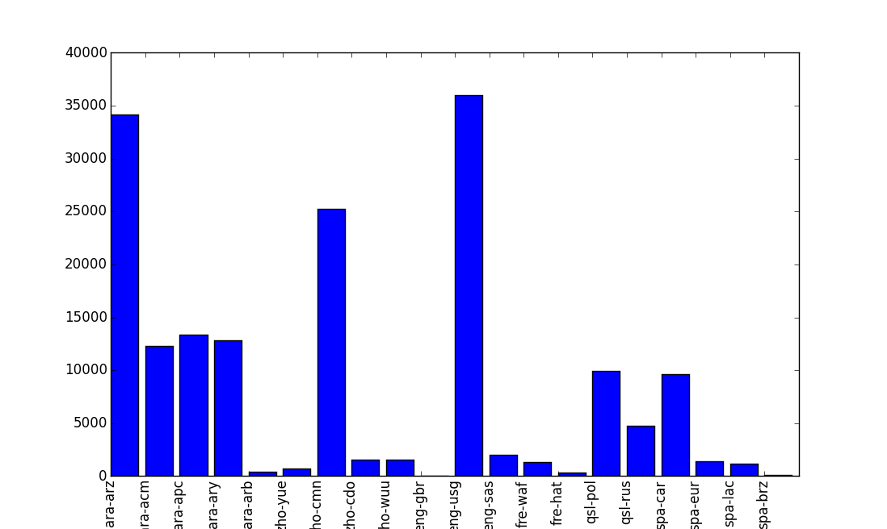
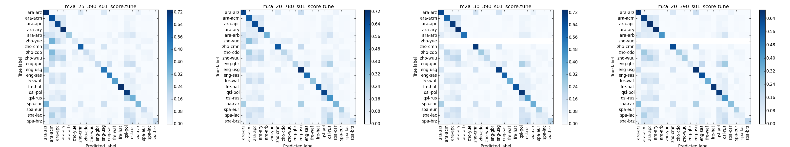
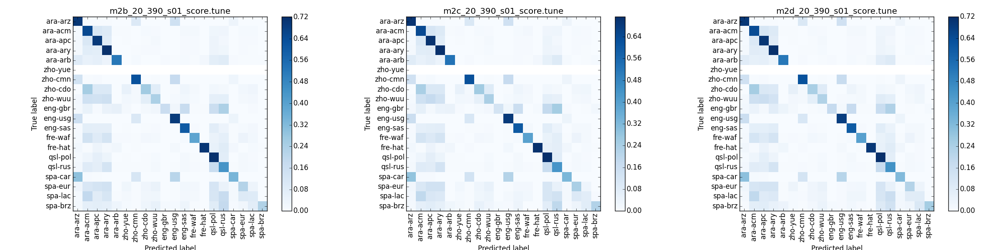
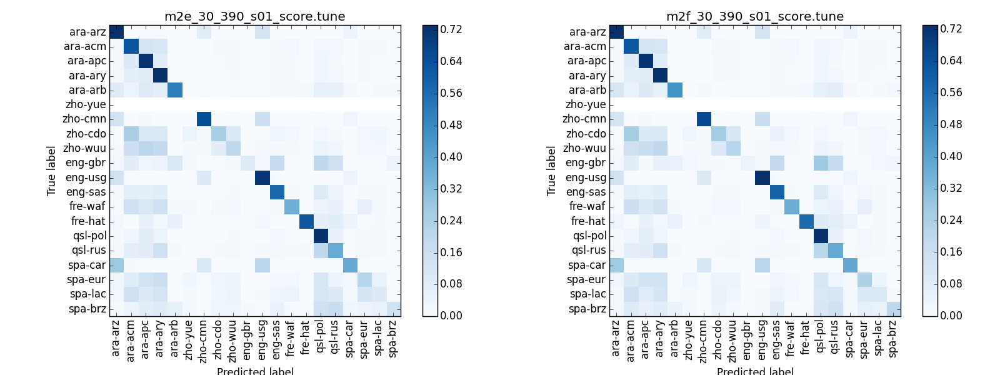

# Data Distribution
|Set|ara-arz|ara-acm|ara-apc|ara-ary|ara-arb|zho-yue|zho-cmn|zho-cdo|zho-wuu|eng-gbr|eng-usg|eng-sas|fre-waf|fre-hat|qsl-pol|qsl-rus|spa-car|spa-eur|spa-lac|spa-brz|
|----|------|------|------|------|------|------|------|------|------|------|------|------|------|------|------|------|------|------|------|------|
|Full|34139|12287|13376|12793|406|721|25241|1520|1527|47|35964|2025|1350|323|9941|4763|9654|1435|1172|105|



-------------------------------------
-------------------------------------

# m1a
### Specification:
| Type | Size | Note | Output |
|------|------|------|--------|
|LSTM|512|in_out activation: sigmoid & tanh|(nb_samples,512)|
|FC|20|output;softmax|(nb_samples,20)|

### Note:
* This model mainly for features and hyperparameters selection 
* The model train very fast to 55% accuracy then saturation

# m1b
### Specification:
| Type | Size | Note | Output |
|------|------|------|--------|
|LSTM|1024|in_out activation: sigmoid & tanh|(nb_samples,512)|
|FC|20|output;softmax|(nb_samples,20)|

### Note:
* This model mainly for features and hyperparameters selection 

# Results:
|Set|Feature (left context, sequence length, n_shift)| LRE test score |
|---|------------------------------------------------|----------------|
|**m1a**|
|set01-test|10_20_10|{'fre': 39, 'eng': 35, 'qsl': 43, 'ara': 33, 'spa': 36, 'zho': 38}|
|set01-test|1_20_1|{'fre': 50.0, 'eng': 48, 'qsl': 46, 'ara': 38, 'spa': 40, 'zho': 45}|
|set01-test|10_20_5|{'fre': 13, 'eng': 33, 'qsl': 30, 'ara': 24, 'spa': 35, 'zho': 34}|
|set01-test|10_30_10|{'fre': 26, 'eng': 31, 'qsl': 29, 'ara': 23, 'spa': 34, 'zho': 36}|
|**m1b**|
|set01-test|10_20_10|{'fre': 40, 'eng': 35, 'qsl': 44, 'ara': 35, 'spa': 36, 'zho': 38}|
|set01-test|1_20_1|{'fre': 50, 'eng': 50, 'qsl': 47, 'ara': 40, 'spa': 40, 'zho': 47}|
|set01-test|10_20_5|{'fre': 17, 'eng': 32, 'qsl': 35, 'ara': 24, 'spa': 35, 'zho': 35}|
|set01-test|10_30_10|{'fre': 25, 'eng': 31, 'qsl': 23, 'ara': 22, 'spa': 33, 'zho': 35}|

### Conclusions:

* Improvement when using longer sequence (in 10_30_10, with sequence length of 30)
* 1_20_1, which doesn't use left context, has very low performance
* An overlap context 10_20_5, which has 5 frames of overlap for each sample in sequence, also gives improved results

-------------------------------------
-------------------------------------

# m2a
| Type | Size | Note | Output |
|------|------|------|--------|
|LSTM|421|GaussianNoise;Dropout(0.2)|(nb_samples,421)|
|LSTM|421|GaussianNoise;Dropout(0.2)|(nb_samples,421)|
|FC|20|output;softmax|(nb_samples,20)|

### Hypothesis:
* Compare to m1b, "Same number of parameters, Does deeper network perform better?" - **Yes**

# Results:

### LRE Score

|Feature (left context, sequence length, n_shift)| Tune Result | Test Result|
|------------------------------------------------|-------------|-------------|
|10_20_10|Cavg:{'fre': 1.90, 'eng': 16.23, 'qsl': 17.20, 'ara': 11.53, 'spa': 22.30, 'zho': 25.33} - Ctotal:15.7485715366|Cavr:{'fre': 0.0, 'eng': 7.8, 'qsl': 0.078, 'ara': 2.13, 'spa': 0.11, 'zho': 0.0} - Ctotal:1.68|
|10_20_5|Cavg:{'fre': 2.68, 'eng': 14.74, 'qsl': 25.29, 'ara': 14.27, 'spa': 25.91, 'zho': 27.15} - Ctotal:18.34|Cavg:{'fre': 0.10, 'eng': 3.89, 'qsl': 2.44, 'ara': 8.01, 'spa': 1.78, 'zho': 0.24} - Ctotal:2.74|
|10_30_10|Cavg:{'fre': 1.67, 'eng': 16.35, 'qsl': 19.41, 'ara': 9.81, 'spa': 23.74, 'zho': 25.06} - Ctotal:16.01|{'fre': 0.0, 'eng': 7.22, 'qsl': 0.15, 'ara': 0.68, 'spa': 0.0, 'zho': 0.044} - Ctotal:1.35|
|20_20_20|Cavg:{'fre': 4.28, 'eng': 12.53, 'qsl': 17.51, 'ara': 13.16, 'spa': 24.99, 'zho': 26.23} - Ctotal:16.45|Cavg:{'fre': 0.0, 'eng': 3.33, 'qsl': 0.15, 'ara': 0.97, 'spa': 0.06, 'zho': 0.058} - Ctotal:0.76|

### Cross entropy and accuracy score:

|Model| Tuning score Loss| Accuracy|
|-----|------------------|---------|
|10_20_5 | 1.57863912  | 0.5976438 |
|20_20_20| 1.96246633  | 0.62271405|
|10_30_10| 1.6676159   | 0.64255028|
|10_20_10| 1.64084811  | 0.62331043|



### Conclusions:

* Feature with overlap like: 10_20_5 give poor performance with deep model. The explanation can be, with overlap, the features become more correlated which mess up the training process.
* Longer sequence and more left context improve the perforamnce
* Use more than 10 left context (e.g. 20_20_20), easy overfitting, however, with right learning strategy can significant improve performance.
* In general, deeper model gain the better score, however, m2a will saturation after first 10 epochs.

-------------------------------------
-------------------------------------

# m2b
| Type | Size | Note | Output |
|------|------|------|--------|
|LSTM|421|GaussianNoise;Dropout(0.2)|(nb_samples,421)|
|LSTM|421|GaussianNoise;Dropout(0.2)|(nb_samples,421)|
|LSTM|421|GaussianNoise;Dropout(0.2)|(nb_samples,421)|
|FC|1024|relu;GaussianNoise;Dropout(0.3)|(nb_samples,1024)|
|FC|512|relu;GaussianNoise;Dropout(0.3);bottleneck|(nb_samples,512)|
|FC|1024|relu;GaussianNoise;Dropout(0.3)|(nb_samples,1024)|
|FC|20|output;softmax|(nb_samples,20)|
**GaussianNoise**: set to 0 for pretraining, then 0.075

### Hypothesis:
* Compare to m2a, "Can adding Fully connected layer improve performance?" - **Yes**

# m2c
| Type | Size | Note | Output |
|------|------|------|--------|
|PLSTM|421|GaussianNoise;Dropout(0.2)|(nb_samples,421)|
|PLSTM|421|GaussianNoise;Dropout(0.2)|(nb_samples,421)|
|PLSTM|421|GaussianNoise;Dropout(0.2)|(nb_samples,421)|
|FC|1024|relu;GaussianNoise;Dropout(0.3)|(nb_samples,1024)|
|FC|512|relu;GaussianNoise;Dropout(0.3);bottleneck|(nb_samples,512)|
|FC|1024|relu;GaussianNoise;Dropout(0.3)|(nb_samples,1024)|
|FC|20|output;softmax|(nb_samples,20)|
**PLSTM**: peephole LSTM; **GaussianNoise**: set to 0 for pretraining, then 0.075

### Hypothesis:
* Compare to m2b, peephole can model more precise timing, "Can it out perform m2b?" - **No** the peephole make model hard to train and slower to convergent

# m2d
| Type | Size | Note | Output |
|------|------|------|--------|
|PLSTM|421|GaussianNoise;Dropout(0.2)|(nb_samples,421)|
|PLSTM|421|GaussianNoise;Dropout(0.2)|(nb_samples,421)|
|PLSTM|421|GaussianNoise;Dropout(0.2):return_sequence|(nb_samples,5,421)|
|FC|1024|relu;GaussianNoise;Dropout(0.3)|(nb_samples,1024)|
|FC|512|relu;GaussianNoise;Dropout(0.3);bottleneck|(nb_samples,512)|
|FC|1024|relu;GaussianNoise;Dropout(0.3)|(nb_samples,1024)|
|FC|20|output;softmax|(nb_samples,20)|
**GaussianNoise**: set to 0 for pretraining, then 0.075


### Hypothesis:
* Compare to m2c, the third layer instead of returning final output of sequence, will return the last 5 sequence outputs, which forming 421*5=2105 features into next Fully connected layer. "Can it out perform m2c?" - **No answer yet**

# Results

**The 3 model were trained on 10_20_10 dataset**

### LRE score
wating for calculation

### Crossentropy and accuracy score

|Model| Tuning score Loss| Accuracy|
|-----|------------------|---------|
|m2a| 1.77176961|  0.63860367|
|m2c| 1.81030558|  0.635191  |
|m2d| 1.8658803 |  0.63295268|



### Conclusions:

* Adding peephole over-complex model and give no improvement, however, with long sequence input, we can benefit from peephole LSTM
* Returning sequence after LSTM layers is unecessary, as we feed a sequence of 20 sample to LSMT, we have:

```
 o1      o2            o20
 |       |              |
LSTM -> LSTM ..... -> LSTM    =>   Sequence of 5 output: (o16,o17,o18,o19,o20)
 |       |              |                 Single output: o20
x1       x2            x20
```
Most of important information about the pattern of sequence will be concentrated at the final output (1 possibility for returning the whole sequence of output is when we have very long and complex input sequence and 1 output is not enough).

* zho-yue and spa cluster have very low accuracy, because network is biased to the "strong cluster" (cluster which high amount of data) => **Idea: Multi-task learning?**

-------------------------------------
-------------------------------------

# m2e
| Type | Size | Note | Output |
|------|------|------|--------|
|BiDirectionLSTM|250|mode=sum;GaussianNoise;Dropout(0.2)|(nb_samples,250)|
|BiDirectionLSTM|250|mode=sum;GaussianNoise;Dropout(0.2)|(nb_samples,250)|
|BiDirectionLSTM|250|mode=sum;GaussianNoise;Dropout(0.2):return_sequence|(nb_samples,5,250)|
|MaxoutFC|1024|GaussianNoise;Dropout(0.2)|(nb_samples,1024)|
|MaxoutFC|512 |GaussianNoise;Dropout(0.2);bottleneck|(nb_samples,512)|
|MaxoutFC|1024|GaussianNoise;Dropout(0.2)|(nb_samples,1024)|
|FC|20|output;softmax|(nb_samples,20)|
**GaussianNoise**: set to 0 for pretraining, then 0.075

### Hypothesis:
* Compare to m2e, "Can we benifit from BiDirection layer more than single layer?" - **No answer yet**
* Compare to m2f, "Maxout vs Relu for fully connected layer?" - **No answer yet**

# m2f
| Type | Size | Note | Output |
|------|------|------|--------|
|BiDirectionLSTM|250|mode=sum;GaussianNoise;Dropout(0.2)|(nb_samples,250)|
|BiDirectionLSTM|250|mode=sum;GaussianNoise;Dropout(0.2)|(nb_samples,250)|
|BiDirectionLSTM|250|mode=sum;GaussianNoise;Dropout(0.2):return_sequence|(nb_samples,5,250)|
|FC|1024|relu;GaussianNoise;Dropout(0.3)|(nb_samples,1024)|
|FC|512 |relu;GaussianNoise;Dropout(0.3);bottleneck|(nb_samples,512)|
|FC|1024|relu;GaussianNoise;Dropout(0.3)|(nb_samples,1024)|
|FC|20|output;softmax|(nb_samples,20)|
**GaussianNoise**: set to 0 for pre-training, then 0.075

### Hypothesis:
* Compare to m2e, "Maxout vs Relu for fully connected layer?" - **No answer yet**

# Results

**The 2 models were trained on 10_30_10 dataset, longer sequence dataset**

### LRE score
wating for calculation

### Crossentropy and accuracy

|Model| Tuning score Loss| Accuracy|
|-----|------------------|---------|
|m2e| 1.33782597 | 0.65386724 |
|m2f| 1.27860457 | 0.65602882 |



### Conclusions

* First and foremost, BiDirectionLSTM improved the performance of our model.
* Both model provide similar performance, however, they are only in early state of training (underfitting)
* Maxout model consume 49MB storage, which is heavier than Relu with only 26MB. Training with relu is faster in convergence and less sensitive to learning rate.
* The effect of biased data distribution remains.

-------------------------------------
-------------------------------------

# m3a
```
                       Output-cluster:ara
                      /
----LSTM----FC------> - Output-cluster:zho
                      \
                       - ...
```

| Type | Size | Note | Output |
|------|------|------|--------|
| -------- Sequential layers:|
|PLSTM|421|GaussianNoise;Dropout(0.2)|(nb_samples,421)|
|PLSTM|421|GaussianNoise;Dropout(0.2):return_sequence|(nb_samples,5,421)|
|FC|1024|relu;GaussianNoise;Dropout(0.3)|(nb_samples,1024)|
|FC|512 |relu;GaussianNoise;Dropout(0.3);bottleneck|(nb_samples,512)|
|FC|1024|relu;GaussianNoise;Dropout(0.3)|(nb_samples,1024)|
| -------- Output layers:|
|FC|5|output0;softmax|(nb_samples,5)|
|FC|4|output1;softmax|(nb_samples,4)|
|FC|3|output2;softmax|(nb_samples,3)|
|FC|2|output3;softmax|(nb_samples,2)|
|FC|2|output4;softmax|(nb_samples,2)|
|FC|4|output5;softmax|(nb_samples,4)|
|**Graph**: this is graph neural network, _1-in-6-out_; **GaussianNoise**: set to 0 for pre-training, then 0.075|

# m3b
```
              ____ FC ____> Output-cluster:ara
             /
----LSTM----> ---- FC ----> Output-cluster:zho
             \
              - ...
```


| Type | Size | Note | Output |
|------|------|------|--------|
| -------- Sequential layers:|
|LSTM|421|GaussianNoise;Dropout(0.2)|(nb_samples,421)|
|LSTM|421|GaussianNoise;Dropout(0.2)|(nb_samples,421)|
|LSTM|421|GaussianNoise;Dropout(0.2)|(nb_samples,421)|
| -------- Output Cluster ara:|
|FC|512|relu;GaussianNoise;Dropout(0.3)|(nb_samples,512)|
|FC|256|relu;GaussianNoise;Dropout(0.3);bottleneck|(nb_samples,256)|
|FC|512|relu;GaussianNoise;Dropout(0.3)|(nb_samples,512)|
|FC|5|output0;softmax|(nb_samples,5)|
| -------- Output Cluster zho:|
|FC|512|relu;GaussianNoise;Dropout(0.3)|(nb_samples,512)|
|FC|256|relu;GaussianNoise;Dropout(0.3);bottleneck|(nb_samples,256)|
|FC|512|relu;GaussianNoise;Dropout(0.3)|(nb_samples,512)|
|FC|4|output1;softmax|(nb_samples,4)|
| -------- Output Cluster eng:|
|FC|512|relu;GaussianNoise;Dropout(0.3)|(nb_samples,512)|
|FC|256|relu;GaussianNoise;Dropout(0.3);bottleneck|(nb_samples,256)|
|FC|512|relu;GaussianNoise;Dropout(0.3)|(nb_samples,512)|
|FC|3|output2;softmax|(nb_samples,3)|
| -------- Output Cluster fre:|
|FC|512|relu;GaussianNoise;Dropout(0.3)|(nb_samples,512)|
|FC|256|relu;GaussianNoise;Dropout(0.3);bottleneck|(nb_samples,256)|
|FC|512|relu;GaussianNoise;Dropout(0.3)|(nb_samples,512)|
|FC|2|output3;softmax|(nb_samples,2)|
| -------- Output Cluster qsl:|
|FC|512|relu;GaussianNoise;Dropout(0.3)|(nb_samples,512)|
|FC|256|relu;GaussianNoise;Dropout(0.3);bottleneck|(nb_samples,256)|
|FC|512|relu;GaussianNoise;Dropout(0.3)|(nb_samples,512)|
|FC|2|output4;softmax|(nb_samples,2)|
| -------- Output Cluster spa:|
|FC|512|relu;GaussianNoise;Dropout(0.3)|(nb_samples,512)|
|FC|256|relu;GaussianNoise;Dropout(0.3);bottleneck|(nb_samples,256)|
|FC|512|relu;GaussianNoise;Dropout(0.3)|(nb_samples,512)|
|FC|4|output5;softmax|(nb_samples,4)|
|**Graph**: this is graph neural network, _1-in-6-out_; **GaussianNoise**: set to 0 for pre-training, then 0.075|

# Results:
Waiting for calculation

-------------------------------------
-------------------------------------

# m3c
| Type | Size | Note | Output |
|------|------|------|--------|
| -------- Sequential layers:|
|BiDirectionLSTM|250|mode=sum;GaussianNoise;Dropout(0.2)|(nb_samples,250)|
|BiDirectionLSTM|250|mode=sum;GaussianNoise;Dropout(0.2)|(nb_samples,250)|
|BiDirectionLSTM|250|mode=sum;GaussianNoise;Dropout(0.2):return_sequence|(nb_samples,5,250)|
|FC|1024|relu;GaussianNoise;Dropout(0.3)|(nb_samples,1024)|
|FC|512 |relu;GaussianNoise;Dropout(0.3);bottleneck|(nb_samples,512)|
|FC|1024|relu;GaussianNoise;Dropout(0.3)|(nb_samples,1024)|
| -------- Output layers:|
|FC|5|output0;softmax|(nb_samples,5)|
|FC|4|output1;softmax|(nb_samples,4)|
|FC|3|output2;softmax|(nb_samples,3)|
|FC|2|output3;softmax|(nb_samples,2)|
|FC|2|output4;softmax|(nb_samples,2)|
|FC|4|output5;softmax|(nb_samples,4)|
|**Graph**: this is graph neural network, _1-in-6-out_; **GaussianNoise**: set to 0 for pre-training, then 0.075|

### Hypothesis:
* Using BiDirectionLSTM, waiting for m3a and m3b determine which approach is better - **No answer yet**

-------------------------------------
-------------------------------------

# Nota benes:

### Training strategy:
4 phases training:

* Pre-training: with _lr = 1e-3_ + _GaussianNoise(0.0)_, 2 epoch
* Average-training: with _lr = 1e-4_ + _GaussianNoise(0.075)_, 5 epoch
* Stable-training: with _lr = 1e-5_ + _GaussianNoise(0.025)_, 5 epoch
* Fine-tuning: with _lr = 1e-6_ + _GaussianNoise(0.0075)_, 5 epoch

### What next?

* Better features:


* Adding convoluational layers to extract invariant features:
* Stronger regularization to prevent overfitting: Dropout, Noise, Pretraining.